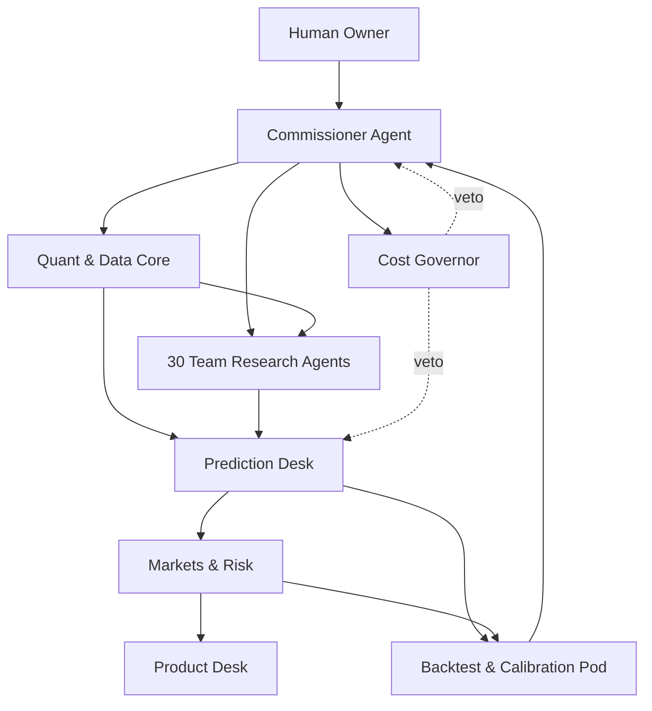

A lean NBA agent company should treat Andrew's daily RAPM-decomp model as the forecasting engine, then use free agents for team context, scenario review, audit, market comparison, and public explanation.

Related: [[NBA multi-agent forecasting company]], [[NBA agent company structure plan]], [[Cheap model strategy for NBA agents]], [[RAPM]], [[Forecast skill]].

## Design Thesis

The smaller company should not try to recreate the 408-agent design with fewer bodies. It should change the center of gravity.

The proprietary daily [[RAPM]] decomp model is the quant desk. It owns player values, team ratings, and baseline predictions for the 2026-27 season. The agent company should sit around that model as:

- **research layer:** one agent per NBA team.
- **scenario layer:** agents translate injuries, rotations, trades, and schedule context into deltas.
- **forecast layer:** agents package model outputs into scoreable season and game probabilities.
- **market layer:** agents compare house lines to markets, but only for paper trading.
- **audit layer:** agents track leakage, calibration, drift, and model-vs-agent lift.
- **product layer:** agents make the live dashboard feel like a company.

The rule is simple: **agents can explain, challenge, and scenario-adjust the model; they cannot silently replace it.**

## Company Size

### Core Lean Company: 41 Agents

| Department | Agents | Main job |
|---|---:|---|
| Executive & Ops | 2 | Run the slate cycle and enforce zero-dollar inference. |
| Quant & Data Core | 3 | Package RAPM snapshots, validate data, and prevent leakage. |
| Team Research Committee | 30 | One agent per team, responsible for context and scenario notes. |
| Prediction Desk | 3 | Convert model/team packets into season and game forecasts. |
| Markets & Risk | 2 | Compare to odds and issue paper-bet decisions. |
| Product Desk | 1 | Turn outputs into website-readable company narration. |

Total: **41 agents**.

### Expanded Lean Company: 53 Agents

The 53-agent version adds more specialization without returning to the 408-agent overhead:

| Add-on | Agents | Use |
|---|---:|---|
| Calibration & Backtest Pod | 4 | Walk-forward replay, Brier/log score, CLV, leakage reports. |
| Scenario Pod | 4 | Injury, trade, rotation, and rest/travel scenario stress tests. |
| Market Microstructure Pod | 2 | No-vig, book shopping, exchange liquidity, stale-line flags. |
| Website Story Pod | 2 | Dashboard copy, agent status cards, public recaps. |

The 41-agent company should be the default. The 53-agent company is for when the website needs more visible motion.

## Authority Pyramid



The Commissioner Agent is not a handicapper. It schedules the daily cycle, requests packets, routes disputes, and writes the final slate memo. It cannot change the RAPM model output or push through a paper bet that fails risk rules.

## Free-Only Runtime Policy

The core system must run at **$0 inference cost**.

Default order:

1. **Deterministic code** for model runs, odds math, joins, scoring, and leakage checks.
2. **Local LLMs** through Ollama, llama.cpp, vLLM, or another local OpenAI-compatible server.
3. **Free hosted APIs** only as opportunistic accelerators with strict quotas.
4. **No paid fallback** in the default runtime.

Hosted free APIs are useful, but they should never be required for the nightly run. If all hosted free quotas fail, the company should still publish:

- RAPM model ratings.
- team ratings.
- game probabilities.
- paper-bet board.
- cached team-agent memos.
- dashboard status showing which agents slept.

### Proprietary Data Rule

Because the RAPM decomp model is proprietary, raw model internals should stay local by default. Free hosted APIs may have data-use terms, retention policies, rate limits, or model-provider routing that are not ideal for private research.

Use this split:

| Packet | Allowed runtime |
|---|---|
| Raw player RAPM decomp, model coefficients, proprietary features | Local only. |
| Rounded player ratings, team ratings, public injury/news summaries | Local or hosted free. |
| Public dashboard explanations | Local or hosted free. |
| Paper-bet recommendations with no private coefficients | Local or hosted free. |

The cleanest MVP is local-only for everything agentic. Free hosted models can be added later for speed or variety.

## Executive & Ops

### 1. Commissioner Agent

**Purpose:** run the company day.

**Inputs:**

- current date and slate.
- RAPM model snapshot ID.
- team-agent packet status.
- market feed status.
- backtest/live mode.
- cost governor status.

**Outputs:**

- daily run agenda.
- list of active team agents.
- final slate memo.
- skipped-agent report.
- website "front office note."

**Cannot:**

- alter model ratings.
- override leakage gates.
- fabricate missing source data.
- approve real betting.

### 2. Cost Governor

**Purpose:** enforce the free-only constraint.

This can be mostly code with an agent-facing identity. It refuses any model call where expected cost is above zero, quota is exhausted, or a proprietary packet would leave the local machine.

```yaml
cost_policy:
  max_daily_usd: 0
  paid_models_allowed: false
  proprietary_packet_cloud_allowed: false
  hosted_free_calls_optional: true
  local_fallback_required: true
```

## Quant & Data Core

This is the real engine room. Most of it should be code, not LLMs.

### 3. RAPM Model Steward

**Purpose:** own the daily model snapshot.

**Inputs:**

- player RAPM decomp ratings.
- projected minutes.
- team aggregation.
- season simulations for 2026-27.
- game-level model predictions.

**Outputs:**

- Model Snapshot Manifest.
- Player Value Board.
- Team Strength Board.
- Season Projection Packet.
- Game Baseline Packet.

The steward does not make narrative arguments. It tells the rest of the company what the model currently says.

### 4. Data Integrity Agent

**Purpose:** check that the model inputs and public context are sane.

Checks:

- missing players.
- stale team assignments.
- impossible minutes projections.
- duplicated game IDs.
- injury statuses after decision timestamp.
- transaction timing.
- home/away and rest-day errors.

### 5. Packet Builder

**Purpose:** translate model outputs into agent-readable packets.

The Packet Builder should hide raw coefficients and expose structured summaries:

```yaml
team_packet:
  team:
  as_of_timestamp:
  model_snapshot_id:
  team_rating:
  offensive_rating_component:
  defensive_rating_component:
  pace_adjustment:
  projected_wins:
  playoff_odds:
  top_positive_players:
  top_negative_players:
  rotation_minutes:
  uncertainty_band:
  recent_rating_change:
  known_context:
```

This is how the team agents get useful information without receiving the full proprietary model.

## Team Research Committee

The Research Department has exactly **30 agents**, one per NBA team.

Each team agent is a "team desk chair," not an eight-agent subcommittee. It owns one team packet, one context memo, and one scenario board.


### Team Agent Responsibilities

Each team agent answers five questions:

1. What does the RAPM-decomp model believe about this team?
2. Which players or rotation assumptions drive that rating?
3. What current context might make the model stale?
4. What scenarios would materially move the team rating?
5. How confident is the agent that the model's view is still valid?

### Standard Team Agent Output

```yaml
team_agent_report:
  team:
  as_of_timestamp:
  model_snapshot_id:
  model_rating_summary:
  rating_driver_notes:
  rotation_fragility:
  injury_scenarios:
  trade_or_transaction_notes:
  g_league_or_two_way_notes:
  schedule_context:
  model_challenge:
  proposed_context_delta:
    points_per_100:
    probability:
    reason:
  confidence:
  citations_or_packet_fields:
```

The most important field is `model_challenge`. The team agent should not say "I like this roster." It should say: "the model may be overstating this team by 1.2 points per 100 if the projected backup center minutes are wrong."

### Virtual Grouping

Do not add division leads in the core version. The interface can still show:

- Atlantic room.
- Central room.
- Southeast room.
- Northwest room.
- Pacific room.
- Southwest room.

Those are display groups, not extra agents. The 30 team agents are the whole research committee.

## Prediction Desk

The Prediction Desk is deliberately tiny because the proprietary model already produces predictions.

### 36. Season Forecaster

**Purpose:** publish 2026-27 season projections.

Inputs:

- RAPM team ratings.
- win simulations.
- team-agent context deltas.
- uncertainty bands.

Outputs:

- projected wins.
- division/conference ranks.
- playoff/play-in odds.
- finals odds if modeled.
- biggest model-vs-agent disagreements.

### 37. Game Forecaster

**Purpose:** produce game probabilities from the model baseline.

Inputs:

- Game Baseline Packet.
- active team-agent reports.
- home/away, rest, travel, injuries.
- calibrated uncertainty.

Outputs:

- moneyline probability.
- spread distribution.
- total distribution if modeled.
- fair line.
- context-adjusted line.
- confidence.

### 38. Scenario Skeptic

**Purpose:** be the anti-overfitting voice.

The Scenario Skeptic asks whether a team-agent delta is real or just narrative dressing around the latest news. It should favor the model unless there is a concrete minutes, injury, role, or matchup mechanism.

Typical veto:

```yaml
skeptic_review:
  target_game_or_team:
  challenged_delta:
  reason_for_veto:
  base_rate_note:
  final_recommended_delta:
```

## Markets & Risk

This department is small because the project is paper trading.

### 39. Market Comparator

**Purpose:** compare house probabilities to available markets.

Inputs:

- model/agent fair line.
- sportsbook odds.
- exchange odds if available.
- closing line snapshots.

Outputs:

- no-vig market probability.
- edge estimate.
- stale-line warning.
- market disagreement summary.

### 40. Paper Risk Manager

**Purpose:** turn edge into a paper bet or no-bet.

The risk manager should be mostly deterministic:

- no bet below edge threshold.
- cap stake by fractional Kelly.
- cap total slate exposure.
- cap same-team correlated exposure.
- require liquidity sanity for exchange markets.
- tag all bets as paper-only.

The agent's job is to explain the decision, not compute the math by hand.

## Product Desk

### 41. Dashboard Narrator

**Purpose:** make the system legible.

Outputs:

- daily front page recap.
- team-agent status cards.
- model movers.
- biggest disagreements.
- paper-bet board explanation.
- postgame scoring recap.

This agent is allowed to be theatrical. It should never invent facts, but it can make the dashboard feel like a living company.

## Optional Expanded Agents

Use these only if the 41-agent version feels too quiet.

| Agent | Department | Trigger |
|---|---|---|
| Injury Scenario Agent | Scenario Pod | high-value questionable player. |
| Rotation Scenario Agent | Scenario Pod | preseason, trades, new coach, unstable bench. |
| Trade/Transaction Agent | Scenario Pod | signing, trade, waiver, two-way change. |
| Rest/Travel Agent | Scenario Pod | dense schedule or altitude/travel spot. |
| Calibration Analyst | Backtest Pod | weekly scoring review. |
| Closing Line Value Analyst | Backtest Pod | market comparison review. |
| Leakage Auditor | Backtest Pod | every historical replay. |
| Agent Lift Analyst | Backtest Pod | measures whether agents improved over model-only. |
| Exchange Liquidity Agent | Market Pod | Kalshi/Polymarket style market available. |
| Book Shopping Agent | Market Pod | multiple sportsbook lines available. |
| Agent Status Designer | Website Pod | live org-chart animation. |
| Postgame Recap Writer | Website Pod | daily dashboard recap. |

## Daily Run

### Morning Model Cycle

1. RAPM model produces player decomp ratings.
2. Model aggregates to team ratings and season/game predictions.
3. RAPM Model Steward writes the snapshot manifest.
4. Data Integrity Agent checks obvious schema and timestamp problems.
5. Packet Builder creates team and game packets.

### Team Research Cycle

1. Activate only teams with games, injuries, transactions, or meaningful rating movement.
2. Team agents read their packet and write context deltas.
3. Inactive teams keep cached reports.
4. Commissioner checks missing packets.

### Prediction Cycle

1. Game Forecaster starts from model baseline.
2. Team-agent deltas are applied only if the Scenario Skeptic accepts them.
3. Season Forecaster updates season board if the game or news meaningfully shifts projections.
4. Outputs are saved as scoreable JSON.

### Market Cycle

1. Market Comparator converts odds to no-vig probabilities.
2. Paper Risk Manager applies edge and exposure rules.
3. Paper bet tickets are written.
4. Dashboard Narrator publishes the slate page.

### Postgame Cycle

1. Results are attached to forecast IDs.
2. Brier score, log score, calibration, and CLV are updated.
3. Team-agent deltas are scored against model-only baseline.
4. Agents with poor repeated deltas get lower future weight.

## Backtesting Plan

The key question is not "did the agents sound smart?" It is:

> Did the agents improve the proprietary model's forecasts after costs, latency, and leakage controls?

Run three tracks:

| Track | Description | Purpose |
|---|---|---|
| Model-only | RAPM model predictions with no agent adjustments. | Baseline. |
| Model plus team agents | 30 team agents can propose context deltas. | Tests research layer. |
| Model plus full lean company | Prediction, markets, risk, and dashboard agents active. | Tests full workflow. |

Score:

- Brier score.
- log loss.
- calibration by probability bucket.
- spread error.
- closing-line value.
- edge-bucket ROI in paper mode.
- model-only versus agent-adjusted lift.

Agents should have weights. If a team agent repeatedly worsens predictions, the system should keep the agent for explanation but reduce its quantitative influence.

## Prompt Pattern

Each team agent should receive a small, structured packet:

```text
You are the [TEAM] Research Agent.

Your job is not to forecast from scratch. Andrew's RAPM-decomp model is the baseline.
You may challenge the model only through concrete mechanisms:
minutes, availability, role, rotation, schedule, transaction, or matchup.

Return JSON only.
Do not invent injuries, quotes, or transactions.
If the packet is stale or insufficient, say so.
```

This keeps the agents honest and cheap.

## Free Model Stack

### Local First

Use local inference for the default run:

- Ollama for easiest local API.
- llama.cpp or llama-cpp-python if small quantized models are the best fit.
- vLLM if Andrew has hardware that benefits from higher-throughput serving.

The local model does not need to be brilliant. It needs to reliably summarize structured packets, produce JSON, and avoid making up facts.

### Optional Free Hosted

Use only with the Cost Governor:

| Provider | Use | Constraint |
|---|---|---|
| Gemini API free tier | occasional structured summaries or disagreement reviews. | Free-tier data may be used to improve products; do not send raw proprietary packets. |
| Groq Free | fast open-model calls for active slate teams. | Rate limits can bind by requests and tokens. |
| OpenRouter free models | model diversity and public-facing commentary. | Free model availability and terms vary by route/model. |
| Cloudflare Workers AI | tiny website-adjacent calls if deployed on Cloudflare. | Free allocation is daily and measured in Neurons. |
| Mistral Free mode | occasional free API experimentation. | Limits are tied to the account's free mode and can change. |

The free hosted lane is a bonus. Local inference is the real guarantee.

## Minimum Viable Company

Build in this order:

1. **Model spine:** RAPM snapshot, team ratings, game predictions, output manifest.
2. **Packet layer:** team packets and game packets.
3. **30 team agents:** local-only JSON reports.
4. **Game Forecaster + Scenario Skeptic:** model baseline plus accepted deltas.
5. **Market Comparator + Paper Risk Manager:** no-vig odds and paper tickets.
6. **Dashboard Narrator:** make it feel alive.
7. **Backtest harness:** model-only versus agent-adjusted scoring.

This version is small enough to actually build, but still has the fun company shape: a CEO, a quant core, 30 team desks, a prediction desk, a market desk, and a public face.

## Sources

- [Ollama API documentation](https://docs.ollama.com/api/introduction).
- [Ollama local authentication note](https://docs.ollama.com/api/authentication).
- [llama-cpp-python OpenAI-compatible server](https://llama-cpp-python.readthedocs.io/en/latest/server/).
- [vLLM OpenAI-compatible server](https://docs.vllm.ai/en/stable/serving/online_serving/).
- [Gemini API pricing](https://ai.google.dev/gemini-api/docs/pricing) and [Gemini API rate limits](https://ai.google.dev/gemini-api/docs/rate-limits).
- [Groq rate limits](https://console.groq.com/docs/rate-limits) and [Groq models](https://console.groq.com/docs/models).
- [OpenRouter free models](https://openrouter.ai/collections/free-models), [OpenRouter free router](https://openrouter.ai/openrouter/free), and [OpenRouter pricing](https://openrouter.ai/pricing).
- [Cloudflare Workers AI pricing](https://developers.cloudflare.com/workers-ai/platform/pricing/).
- [Mistral usage limits](https://docs.mistral.ai/admin/billing-usage/usage-limits).

## Open questions

- Which local model is reliable enough for strict JSON team-agent reports on Andrew's hardware?
- How much of each player RAPM decomp can be exposed to team agents without leaking proprietary model internals?
- What threshold should a team-agent context delta clear before it can move the model baseline?
- Does the 30-agent research layer beat the RAPM-only baseline in walk-forward scoring?
