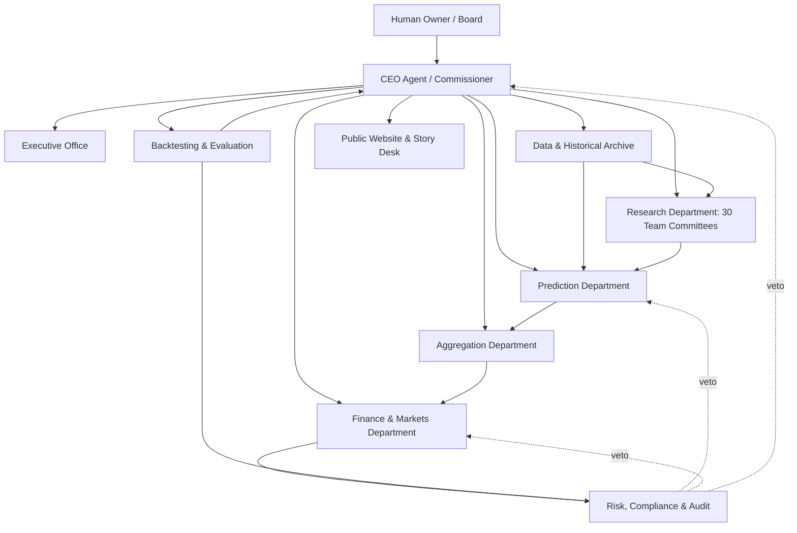

A multi-agent NBA forecasting company should make every team committee an expert research desk, then force those desks through independent prediction, calibrated aggregation, market comparison, finance, and backtesting layers.

Related: [[Basketball]], [[Multi-agent forecasting frameworks]], [[Designed information asymmetry for LLM forecasts]], [[Ensemble forecasting]], [[Forecast skill]].

## Design Thesis

The company should feel like a basketball front office, a betting syndicate, and a forecasting lab braided together.

The key split:

- **Research Department:** 30 team subcommittees, each an expert on one NBA team.
- **Prediction Department:** model and agent forecasters consume team research without becoming attached to any team narrative.
- **Aggregation Department:** turns many forecasts into calibrated game and season probabilities.
- **Finance Department:** compares probabilities against sportsbooks, Vegas-style lines, Kalshi, Polymarket, and other markets.
- **Backtesting Department:** walks the system through the completed 2025-26 season as if it were live.
- **Risk, Compliance & Audit:** prevents leakage, illegal wagering, overbetting, and untracked model drift.

The core principle is the same as [[Designed information asymmetry for LLM forecasts]]: do not give every agent the same blob of context. Team committees should develop private, team-specific expertise. Prediction agents should receive structured packets from the relevant teams, plus league context, and then produce scoreable probability distributions.

## Corporate Charter

**Mission:** produce probabilistic NBA forecasts and paper-bet recommendations through an auditable multi-agent company.

**Primary outputs:**

- preseason win projections for all 30 teams.
- playoff/play-in odds.
- game moneyline probabilities.
- spread cover probabilities.
- total over/under probabilities.
- player-availability-adjusted game simulations.
- market-edge board versus sportsbook odds, Kalshi, and Polymarket.
- backtested performance, calibration, and closing-line-value reports.

**Default capital mode:** paper betting. Real wagering is out of scope until the system has a leakage-free walk-forward backtest, legal/jurisdiction checks, stake limits, and a human approval gate.

**Primary backtest:** the completed 2025-26 NBA season, walked forward date by date with only information available at each decision timestamp.

## Authority Pyramid



The CEO is a process agent, not a handicapper. It schedules the slate, routes packets, enforces deadlines, and writes the final memo. It cannot alter forecasts, override leakage warnings, or force a bet through risk.

## Agent Population

The full "company theater" is intentionally large, but agents are lazily activated. On a two-game night, only four team committees need full activation. On a 15-game slate, all 30 team committees activate.

| Division | Full agents | Head | Main job |
|---|---:|---|---|
| Executive Office | 8 | CEO Agent | Schedule, route, summarize, escalate. |
| Data & Historical Archive | 18 | Chief Data Officer | Clean NBA, G League, injury, odds, and market data. |
| Research Department | 249 | Chief Research Officer | Maintain 30 team expert committees. |
| Prediction Department | 65 | Chief Prediction Officer | Produce season and game probability distributions. |
| Aggregation Department | 15 | Chief Aggregation Officer | Calibrate, weight, and combine forecasts. |
| Finance & Markets Department | 18 | Chief Markets Officer | Compare to odds and produce paper bet tickets. |
| Backtesting & Evaluation | 16 | Chief Backtesting Officer | Walk-forward simulation, scoring, leakage audits. |
| Risk, Compliance & Audit | 12 | Chief Risk Officer | Veto, legal gate, bankroll rules, audit logs. |
| Public Website & Story Desk | 7 | Head of Public Interface | Make the company legible live. |

Total full roster: **408 agents**. Prototype roster: **75 agents** by compressing each team committee to one Team Chair plus two specialists. Runtime and cost control are handled separately in [[Cheap model strategy for NBA agents]].

## Executive Office

### CEO Agent / Commissioner

**Inputs:**

- upcoming slate.
- current season date.
- active team committee status.
- data health checks.
- market feed status.
- current bankroll or paper bankroll.
- backtest mode or live mode.

**Outputs:**

- daily slate agenda.
- committee activation plan.
- escalation list.
- final slate memo.
- public "Commissioner's note" for the website.

**Permissions:**

- can open, pause, or cancel a slate cycle.
- can ask a committee to rerun a packet.
- can ask Risk to review a market.
- cannot change a probability.
- cannot place or approve a bet.
- cannot override leakage, legal, or bankroll gates.

### Executive Agents

| Agent | Job |
|---|---|
| Chief of Staff | Tracks packet dependencies, missing teams, late forecasts, and reruns. |
| COO | Monitors runtime, cost, queue health, model availability, and data jobs. |
| Chief Basketball Scientist | Owns modeling philosophy and prevents narrative-only prediction. |
| Chief Research Officer | Runs the 30 team committees. |
| Chief Prediction Officer | Runs forecasting protocols. |
| Chief Markets Officer | Runs odds comparison and paper bet issuance. |
| Board Secretary | Writes immutable minutes and public audit summaries. |

## Data & Historical Archive

**Purpose:** create time-stamped, leakage-controlled data packets.

This department should be more deterministic than agentic. Agents supervise schemas, provenance, and anomalies; code should perform the actual ingestion and joins.

### Data Sources

| Source class | Examples | Use |
|---|---|---|
| Official NBA stats | NBA.com/stats, nba_api | box scores, advanced stats, tracking-adjacent tables, schedules, game IDs. |
| Play-by-play and lineup data | PBPStats, NBA play-by-play, hoopR/nba_api | possessions, lineups, on/off, substitution patterns, clutch. |
| Player impact metrics | EPM, DARKO, RAPM, LEBRON/BPM-style metrics | player-strength priors, rotation value, injuries. |
| G League | NBA G League stats, Basketball-Reference G League | two-way players, call-ups, assignments, development depth. |
| Injury/availability | official NBA Injury Report PDFs/pages | out/probable/questionable/rest/G League status. |
| Odds and markets | The Odds API, SportsDataIO/OddsJam/OpticOdds, Kalshi, Polymarket | open/close lines, spreads, totals, moneylines, exchange prices. |
| News/context | team sites, transactions, beat reports, official announcements | rotation changes, coaching comments, rest signals. |

### Data Agents

| Agent | Job |
|---|---|
| NBA Stats Ingest Agent | Pulls team/player/game stats from official and mirrored APIs. |
| Play-by-Play Agent | Builds possessions, pace, lineups, garbage-time flags, and on/off tables. |
| Player Metric Snapshot Agent | Archives daily EPM, DARKO, RAPM-like, BPM, and other impact metric snapshots. |
| G League Ingest Agent | Tracks affiliates, two-way players, assignments, call-ups, and G League production. |
| Injury Report Agent | Parses official reports by timestamp and status. |
| Odds Ingest Agent | Stores sportsbook and exchange odds snapshots by timestamp. |
| Entity Resolution Agent | Maps players, teams, game IDs, market IDs, and book names across sources. |
| Leakage Sentinel | Verifies that no packet includes information from after the decision timestamp. |
| Data QA Agents | Flag missing games, stale lines, impossible minutes, duplicated players, bad timestamps. |
| Archive Librarian | Writes immutable packet manifests and source IDs. |

## Research Department

**Purpose:** make each NBA team committee an expert on one team.

The Research Department does not output bets. It outputs team state, roster state, rotation state, and matchup-relevant facts.

### Hierarchy

```text
Chief Research Officer
  -> Eastern Conference Research Director
     -> Atlantic Division Lead
     -> Central Division Lead
     -> Southeast Division Lead
  -> Western Conference Research Director
     -> Northwest Division Lead
     -> Pacific Division Lead
     -> Southwest Division Lead
  -> 30 Team Committees
```

### The 30 Team Committees

| Conference | Division | Team committees |
|---|---|---|
| East | Atlantic | Celtics, Nets, Knicks, 76ers, Raptors |
| East | Central | Bulls, Cavaliers, Pistons, Pacers, Bucks |
| East | Southeast | Hawks, Hornets, Heat, Magic, Wizards |
| West | Northwest | Nuggets, Timberwolves, Thunder, Trail Blazers, Jazz |
| West | Pacific | Warriors, Clippers, Lakers, Suns, Kings |
| West | Southwest | Mavericks, Rockets, Grizzlies, Pelicans, Spurs |

### Standard Team Committee

Each team has 8 agents:

| Agent | Responsibility | Key outputs |
|---|---|---|
| Team Chair | Integrates the committee and defends the team packet. | Team State Packet, uncertainty notes. |
| Roster & Rotation Agent | Depth chart, projected minutes, rotation stability, closing five. | Rotation Packet. |
| Player Impact Metrics Agent | EPM, DARKO, RAPM, LEBRON/BPM-style priors, age curves. | Player Value Board. |
| Lineup & On/Off Agent | Lineup net rating, RAPM-like context, teammate/opponent effects. | Lineup Strength Packet. |
| Scheme & Four Factors Agent | Shot profile, rim/3PA/midrange, turnovers, rebounding, FTr, pace. | Team Style Packet. |
| Health & Availability Agent | Injuries, rest, return-to-play, questionable-minute scenarios. | Availability Packet. |
| G League & Two-Way Agent | Affiliate roster, two-way players, call-up readiness, emergency depth. | Depth Pipeline Packet. |
| Schedule & Context Agent | Rest, travel, back-to-back, altitude, home/road, emotional spots. | Context Packet. |

The advanced analytics center of gravity is the Player Impact Metrics Agent plus the Lineup & On/Off Agent. Their views should dominate the Team Chair's numerical strength estimate unless the Health or Rotation agents show a major minutes shock.

### Team State Packet

```yaml
team_state_packet_id:
team:
as_of_timestamp:
season_phase:
current_record:
net_rating:
adjusted_net_rating:
pace:
offensive_profile:
defensive_profile:
projected_rotation:
player_impact_board:
lineup_strengths:
injury_scenarios:
g_league_depth:
schedule_context:
recent_form_regressed:
known_unknowns:
committee_confidence:
```

### Game Prep Packet

For each game, both team committees produce a matchup packet:

```yaml
game_prep_packet_id:
game_id:
team:
opponent:
as_of_timestamp:
projected_starters:
rotation_scenarios:
team_strength_mean:
team_strength_interval:
offense_vs_opponent_defense:
defense_vs_opponent_offense:
pace_pressure:
rebounding_matchup:
turnover_matchup:
shot_profile_matchup:
injury_swing_players:
rest_travel_context:
team_chair_summary:
```

## Prediction Department

**Purpose:** convert research packets into probabilities.

Prediction agents cannot browse freely during a slate run. They receive time-stamped packets from Data and Research, then produce scoreable forecasts.

### Prediction Hierarchy

```text
Chief Prediction Officer
  -> Season Forecast Committee
  -> Game Forecast Committee
  -> Player Availability & Minutes Committee
  -> Matchup Simulation Committee
  -> Market-Blind Probability Committee
  -> Model Diversity Desk
  -> Prediction QA Desk
```

### Season Forecast Committee

**Job:** before the season and weekly during the season, forecast:

- team win totals.
- playoff odds.
- play-in odds.
- division/conference title odds.
- championship odds.
- distribution of seed outcomes.

Agents:

- Baseline Ratings Agent.
- Roster Continuity Agent.
- Aging/Development Agent.
- Injury Fragility Agent.
- Schedule Difficulty Agent.
- Depth/G League Upside Agent.
- Coaching/System Stability Agent.
- Monte Carlo Simulator Agent.
- Preseason Market Prior Agent.
- Season Forecast Secretary.

### Game Forecast Committee

**Job:** for each slate, forecast:

- home win probability.
- neutral-court team strength.
- expected margin.
- margin distribution.
- total points distribution.
- spread cover probability.
- over/under probability.

Agents:

| Subcommittee | Agents | Job |
|---|---:|---|
| Baseline Power Rating Pod | 4 | Elo-like, adjusted net rating, player-impact-weighted team ratings. |
| Player Impact Pod | 4 | Converts projected minutes and impact metrics into team strength. |
| Matchup Pod | 4 | Scheme/four-factor matchup: rim, threes, turnovers, rebounding, FTr. |
| Availability Pod | 4 | Questionable players, rest, minutes restrictions, late scratches. |
| Schedule Pod | 3 | Rest, travel, altitude, back-to-back, time zone, fatigue. |
| Recent Form Pod | 3 | Recent performance with regression and opponent adjustment. |
| Total Points Pod | 3 | Pace, shot profile, FT rate, offensive/defensive efficiency distribution. |
| Upset & Tail Risk Pod | 2 | Blowout, foul trouble, variance, bench volatility. |

### Player Availability & Minutes Committee

This committee is crucial because a game model is mostly a minutes-weighted player-value model pretending to be a team model.

Outputs:

- probability each questionable player plays.
- projected minutes distribution.
- replacement-minute allocation.
- starter/bench stagger assumptions.
- garbage-time likelihood.
- closing-lineup scenarios.

### Market-Blind Rule

Most Prediction agents should be market-blind. They do not see sportsbook odds or Kalshi/Polymarket prices. This preserves an independent model probability.

Only the Market Prior Agent and Finance Department see market prices before aggregation. Their job is to compare, not contaminate.

### Forecast Packet

```yaml
forecast_packet_id:
game_id:
forecast_type:
as_of_timestamp:
inputs:
home_win_probability:
away_win_probability:
expected_margin_home:
margin_distribution:
expected_total:
total_distribution:
spread_cover_probabilities:
total_over_probabilities:
key_drivers:
injury_scenarios:
confidence:
model_family:
agent_or_pod_id:
```

## Aggregation Department

**Purpose:** turn many forecasts into one calibrated house line.

The Aggregation Department owns the company's official probability. It should be boring and statistical.

### Agents

| Agent | Job |
|---|---|
| Chief Aggregation Officer | Owns final house line and disagreement report. |
| Calibration Agent | Weights agents by historical Brier score, log loss, MAE, calibration. |
| Diversity Agent | Penalizes redundant models and correlated errors. |
| Market Prior Agent | Compares house line to market-implied probability after the blind forecast exists. |
| Injury Scenario Aggregator | Combines conditional forecasts across player availability scenarios. |
| Spread Distribution Agent | Converts margin distribution to spread probabilities. |
| Totals Distribution Agent | Converts scoring distribution to over/under probabilities. |
| Season Simulation Aggregator | Combines team win projections and playoff odds. |
| Outlier Review Agent | Inspects extreme minority forecasts before they are downweighted. |
| Aggregation Secretary | Writes the final House Line Packet. |

### House Line Packet

```yaml
house_line_packet_id:
game_id:
as_of_timestamp:
home_moneyline_probability:
away_moneyline_probability:
expected_margin_home:
margin_sigma:
expected_total:
total_sigma:
spread_probabilities:
total_probabilities:
top_drivers:
forecast_dispersion:
effective_forecaster_count:
market_prior_comparison:
calibration_warning:
```

## Finance & Markets Department

**Purpose:** compare the house line to tradable prices and issue paper bet tickets.

Finance agents do not decide who is better at basketball. They decide whether a probability edge survives price, vig, fees, liquidity, limits, and correlation.

### Market Sources

- sportsbook moneyline, spread, and totals.
- open, current, and closing lines.
- Kalshi and Polymarket sports markets where available.
- season win totals and futures.
- exchange depth, bid/ask, volume, and settlement rules.

### Agents

| Agent | Job |
|---|---|
| Chief Markets Officer | Owns the market-edge board. |
| Odds Normalization Agent | Converts American odds, spreads, totals, and exchange prices into no-vig probabilities. |
| Sportsbook Comparison Agent | Tracks best available price across books. |
| Prediction Market Agent | Tracks Kalshi/Polymarket event contracts, liquidity, and resolution rules. |
| EV Agent | Computes expected value and edge thresholds. |
| Bankroll Agent | Sizes paper bets using flat stakes and fractional Kelly caps. |
| Correlation Agent | Prevents overexposure to the same game, team, player injury, or market factor. |
| CLV Agent | Tracks closing-line value as an early skill proxy. |
| Bet Ticket Secretary | Writes paper bet tickets. |

### Bet Ticket

```yaml
bet_ticket_id:
game_id:
market:
selection:
book_or_exchange:
line:
odds:
no_vig_market_probability:
house_probability:
edge:
recommended_stake:
paper_or_real:
correlation_group:
risk_approval_id:
expires_at:
```

### Bet Issuance Rules

- Default is paper betting.
- Real betting requires human approval and legal eligibility.
- No bet if edge is below the minimum threshold.
- No bet if the line moved before ticket creation.
- No bet if the market has unclear settlement rules.
- No bet if the edge depends entirely on unconfirmed injury speculation.
- No parlaying by default.
- No player props until the game-level system is proven.

## Backtesting & Evaluation Department

**Purpose:** make the company prove itself in time.

This is not optional. The backtest department is the referee of the entire company.

### Chief Backtesting Officer

Owns the 2025-26 walk-forward simulation. Has authority to invalidate results for leakage.

### 2025-26 Walk-Forward Protocol

For each game day in the 2025-26 season:

1. Set the simulation clock to the decision timestamp.
2. Load only data available before that timestamp.
3. Build Team State Packets for all teams.
4. Activate team committees for that day's slate.
5. Produce market-blind game forecasts.
6. Aggregate house lines.
7. Load odds snapshots available at the same timestamp.
8. Issue paper bet tickets.
9. Advance to game result.
10. Score forecasts and bets.
11. Repeat.

### Required Decision Timestamps

| Timestamp | Purpose |
|---|---|
| Preseason lock | season win totals and futures forecast. |
| Previous night | early model line before day-of news. |
| Morning of game | slate forecast with latest stats and overnight news. |
| Official injury report window | availability-aware update. |
| 60 minutes pregame | final pregame paper-bet decision, if data exists. |
| Closing line | CLV and benchmark comparison only, not decision input. |

### Leakage Rules

- No final-season EPM, DARKO, RAPM, or Basketball-Reference advanced stats may be used for earlier dates unless daily snapshots exist.
- No final record, playoff outcome, or postgame box score may enter a pregame packet.
- No closing line may enter a bet decision made earlier.
- No official result may enter a same-day model update before the simulated game ends.
- No agent may search the web live during historical backtest unless search results are time-filtered and archived.

### Evaluation Metrics

Forecast quality:

- Brier score for moneyline.
- log loss for moneyline.
- calibration curves by probability bucket.
- spread MAE and RMSE.
- total MAE and RMSE.
- probability integral transform / distribution calibration.

Betting quality:

- ROI by market.
- closing-line value.
- hit rate by edge bucket.
- max drawdown.
- Sharpe-like return over stake volatility.
- profit by book/exchange.
- profit by agent/committee driver.

Process quality:

- packet completeness.
- data freshness.
- forecast dispersion.
- effective forecaster count.
- team committee accuracy.
- injury scenario accuracy.
- market movement after recommendation.

## Risk, Compliance & Audit

**Purpose:** keep the company legal, honest, and non-delusional.

### Hard Vetoes

- real wagering without human approval.
- wagering in an illegal jurisdiction or without meeting platform eligibility.
- missing odds timestamp.
- missing injury timestamp for an availability-sensitive forecast.
- stale team packet.
- unclear market settlement.
- bet size above bankroll cap.
- correlated exposure above slate cap.
- backtest leakage.
- prompt/model version not logged.

### Risk Agents

| Agent | Job |
|---|---|
| Chief Risk Officer | Owns veto power. |
| Legal/Jurisdiction Agent | Checks whether any real-money action is allowed. |
| Bankroll Risk Agent | Enforces max stake, daily loss, and drawdown rules. |
| Market Integrity Agent | Flags suspicious lines, bad settlement, and injury-manipulation risk. |
| Model Risk Agent | Tracks overfitting, prompt drift, and metric monoculture. |
| Leakage Auditor | Audits historical runs for future information. |
| Audit Clerk | Writes immutable cycle and backtest logs. |

## Public Website & Story Desk

**Purpose:** make the system visually understandable.

The website should not only show picks. It should show how the company thinks.

### Core Views

- **Company org chart:** live department and committee activity.
- **30 team war rooms:** each team's roster, health, advanced metrics, G League depth, schedule context.
- **Slate board:** all games, house probabilities, market odds, edge, confidence, status.
- **Matchup room:** two team committees' packet summaries side by side.
- **Agent parliament:** prediction pods grouped by game lean and rationale.
- **Injury scenario tree:** probability-weighted outcomes if questionable players play or sit.
- **Market edge board:** no-vig market probability vs house probability.
- **Bet ticket ledger:** paper bets, rejected bets, veto reasons, CLV.
- **Backtest lab:** 2025-26 walk-forward results, calibration, ROI, drawdown, mistakes.
- **Committee scorecards:** which team committees and prediction pods add value.

## Daily Slate Cycle

### Morning Cycle

1. Data Department freezes overnight stats and odds.
2. Research Department updates all 30 Team State Packets.
3. CEO activates only teams on the slate.
4. Prediction Department produces market-blind forecasts.
5. Aggregation Department creates early house lines.
6. Finance records current market deltas but does not issue final bets.

### Injury Cycle

1. Injury Report Agent ingests official availability reports.
2. Health agents update team packets.
3. Player Availability & Minutes Committee produces scenario probabilities.
4. Prediction Department reruns affected games.
5. Aggregation publishes updated house lines.

### Pregame Cycle

1. Data QA checks odds and injury timestamps.
2. Finance identifies edges against current lines.
3. Risk reviews stake, correlation, and legality.
4. Paper bet tickets are issued.
5. Public website updates slate board and trade-court view.

### Postgame Cycle

1. Results and box scores are ingested.
2. Forecasts are scored.
3. Paper bets are settled.
4. CLV is updated.
5. Team committees receive postgame diagnostic tasks.
6. Backtesting logs are locked.

## Preseason Cycle

The preseason product is different from the daily slate product.

### Preseason Research Outputs

Each team committee writes:

- roster continuity report.
- projected rotation.
- player impact board.
- age/development curve.
- injury fragility report.
- G League and two-way depth report.
- coaching/system report.
- schedule difficulty note.
- win projection interval.

### Season Simulation

The Season Forecast Committee runs an 82-game simulation:

- team strength distributions.
- game-by-game win probabilities.
- injury/rest uncertainty.
- schedule effects.
- trade-deadline uncertainty placeholder.
- play-in/playoff simulations.

Outputs:

- mean wins.
- median wins.
- 10th/90th percentile wins.
- division/conference seed probabilities.
- playoff/play-in odds.
- season win total edges versus market.

## Versioned Build Plan

### V0 - Static Company Blueprint

- Build the website using static packets.
- Show all 30 team committees.
- No live data.
- Goal: make the company structure compelling.

### V1 - Data Backbone

- Ingest schedules, scores, box scores, NBA stats, G League stats, and odds.
- Build entity mapping.
- Store timestamped snapshots.
- No LLM forecasts yet.

### V2 - 30 Team Research Committees

- One Team Chair plus two specialists per team.
- Produce daily Team State Packets.
- Add G League and injury modules.

### V3 - Game Prediction Engine

- Add market-blind game forecast packets.
- Model moneyline, spread, and total distributions.
- Add aggregation and calibration.

### V4 - Finance and Paper Betting

- Add odds comparison.
- Add no-vig conversion.
- Add paper bet tickets.
- Add CLV and ROI dashboard.

### V5 - 2025-26 Walk-Forward Backtest

- Freeze simulated date.
- Re-run the company through the full season.
- Publish leakage audit, calibration, and betting performance.

### V6 - Full Agent Theater

- Expand to full 408-agent company.
- Add committee scorecards and visual agent parliament.
- Virtualize inactive agents so the full company can be displayed without paying for 408 fresh calls per slate.
- Keep real betting disabled by default.

## Recommended Technical Architecture

```text
Scheduler
  -> Data snapshot jobs
  -> Team state packet generation
  -> Slate activation
  -> Prediction fanout
  -> Aggregation
  -> Odds comparison
  -> Risk gate
  -> Paper bet ledger
  -> Postgame scorer
  -> Website publisher
```

Recommended stack:

- **Backend:** Python FastAPI.
- **Workflow:** LangGraph for explicit state machines and supervisor routing.
- **Storage:** Postgres plus parquet files for historical snapshots.
- **Modeling:** Python, pandas, polars, scikit-learn/PyMC/Stan as needed.
- **Agent orchestration:** LLM calls only around packet interpretation, debate, and summaries; deterministic code for scoring, odds math, joins, and bet settlement.
- **Frontend:** Next.js or React dashboard with team pages, slate board, and backtest lab.

## Sources

- [Official NBA Stats](https://www.nba.com/stats)
- [NBA G League Stats](https://stats.gleague.nba.com/)
- [nba_api](https://github.com/swar/nba_api)
- [PBPStats](https://www.pbpstats.com/)
- [DARKO](https://www.darko.app/)
- [Dunks & Threes EPM](https://dunksandthrees.com/epm)
- [Dunks & Threes EPM methodology](https://dunksandthrees.com/about/epm)
- [nbarapm](https://www.nbarapm.com/)
- [Official NBA Injury Report](https://official.nba.com/nba-injury-report-2025-26-season/)
- [Basketball-Reference 2025-26 season summary](https://www.basketball-reference.com/leagues/NBA_2026.html)
- [Basketball-Reference 2025-26 preseason odds](https://www.basketball-reference.com/leagues/NBA_2026_preseason_odds.html)
- [The Odds API NBA odds](https://the-odds-api.com/sports-odds-data/nba-odds.html)
- [The Odds API historical odds](https://the-odds-api.com/historical-odds-data/)
- [SportsDataIO betting data guide](https://sportsdata.io/help/betting-data-integration-guide)
- [Kalshi API](https://help.kalshi.com/en/articles/13823854-kalshi-api)
- [Polymarket Sports API](https://docs.polymarket.com/api-reference/sports/get-sports-metadata-information)

## Open questions

- Should team committees be active every day, or only when their team has a game within the next two days?
- Which player-impact metric should define the first baseline: DARKO, EPM, RAPM, or a blended in-house prior?
- Can daily historical EPM/DARKO snapshots be acquired or reconstructed for a leakage-clean 2025-26 backtest?
- Should the first betting markets be moneyline only, or moneyline plus spread and totals?
- Should player props be permanently excluded until the game-level model proves calibration?
